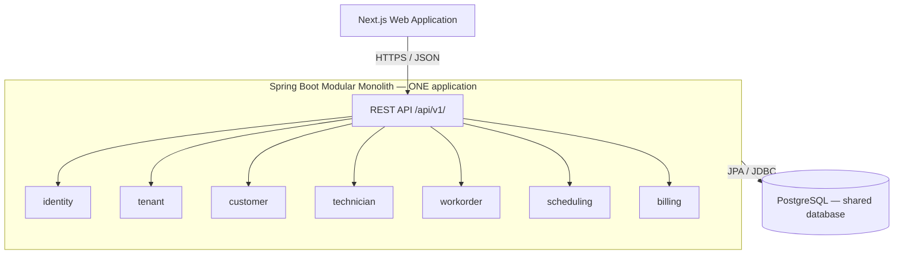

# Architecture v1: modular monolith

Status: target architecture with a Phase 1 application foundation implemented. The domain modules below remain planned. See [ADR 0001](../adr/0001-use-modular-monolith.md) and [ADR 0002](../adr/0002-use-postgresql.md).

## System shape

FieldOps begins with a Next.js web application, one Spring Boot backend application, and PostgreSQL. The backend is a **modular monolith: one application, one deployable backend artifact, and one process per running instance**. Its domain modules are packages inside that application, not microservices or independently deployed containers.

The diagram shows logical areas, not a dependency graph or separate services. Modules use in-process application operations; they do not call each other over HTTP. Frontend and backend can have separate build and deployment lifecycles, while all backend modules deploy together.

## Module responsibilities

| Module | Owns | Boundary |
| --- | --- | --- |
| `identity` | Authentication integration, users, roles, and permission evaluation | Establishes authenticated identity; tenant membership and resource checks still govern business access. |
| `tenant` | Service-business identity, memberships, and tenant settings | Resolves authorized tenant context and business configuration. |
| `customer` | Customer contact details and service addresses | Exposes customer operations and lookups without exposing repositories. |
| `technician` | Technician profiles, skills, and declared availability as needed | Describes who can perform work; scheduling owns actual reservations. |
| `workorder` | Service request details, work items, lifecycle rules, and status history | Validates explicit operations and owns the operational record of the job. |
| `scheduling` | Appointments, technician reservations, and conflict checks | Coordinates visits using technician availability and work-order eligibility. |
| `billing` | Invoices, invoice items, balances, and initial payment recording use cases | Owns financial rules; work-order status changes cannot directly change financial facts. |

As features require them, `servicecatalog`, `payment`, `notification`, `reporting`, and `audit` may become additional internal modules. A dedicated payment module can take ownership of payment records and provider interactions when that boundary is useful. No packages, entities, or interfaces are created merely to fill this map.

## Code organization and communication

Use package-by-domain under `com.fieldops` in `apps/api`. Within a module, separate API/controllers, application use cases, domain rules, and persistence/infrastructure where the feature warrants it. Do not introduce generic base controllers/services/repositories or interfaces without a useful purpose.

Each module owns its persistence access and changes to its records. Other modules call explicit application operations or use defined result types; they do not reach into another module's repositories or serialize its JPA entities. Prefer identifiers and DTOs across boundaries. Record ownership and dependency direction as real use cases arrive, and avoid cyclic module dependencies.

Start synchronously. An application use case may coordinate multiple modules in one database transaction when atomicity is required. Keep transaction boundaries explicit and avoid external network calls inside database transactions. Introducing an internal module does not introduce eventual consistency by itself.

## Tenant isolation and authorization

Use one shared PostgreSQL database with tenant-aware business tables. A tenant is a service business; customer, technician, work-order, appointment, invoice, and payment records belong to that business. Shared identity and platform records need separately defined ownership rather than blindly adding `tenant_id` everywhere.

FIELD-001 proposes one Tenant concept without a separate Business entity, UUID v4 identity, a stable unique slug, ACTIVE/SUSPENDED status, audit timestamps, and optimistic locking. The [tenant domain design](tenant-domain.md) specifies the schema, constraints, indexes, and future ownership rules; [ADR 0003](../adr/0003-tenant-domain-model.md) records the tradeoffs. This is a proposed design, not implemented tenancy; persistence belongs to FIELD-002.

Derive the effective tenant from authenticated identity and validated membership. If a user can select among tenants, validate that selection server-side before establishing context. A submitted `tenant_id`, guessed resource ID, or hidden frontend button is never sufficient authorization.

Scope reads, writes, searches, and relationship lookups by tenant. Use tenant-scoped unique constraints and, where appropriate, composite foreign keys to prevent cross-tenant associations. Background jobs and future events must carry and validate explicit tenant context because they cannot assume an HTTP session.

Backend checks combine role permissions with tenant/resource access. Technician access is limited to permitted work. Platform administration is a distinct authority, not an automatic bypass for business data. Add PostgreSQL-backed integration tests covering cross-tenant reads, mutations, list results, and associations when tenancy is implemented. PostgreSQL row-level security can be evaluated later as defense in depth; it is not an implemented safeguard in this phase.

## Persistence and consistency

Use PostgreSQL as the source of truth and Flyway for every schema change. Released migrations are immutable. Once migrations exist, validate mappings with `ddl-auto=validate`; Hibernate must not evolve production schemas.

Use foreign keys, not-null constraints, and tenant-scoped uniqueness as appropriate. Choose indexes from actual access patterns. Enforce scheduling and financial invariants transactionally, including concurrent requests; a UI availability check alone cannot prevent double booking. Select and test the specific concurrency strategy during the scheduling milestone.

Work-order lifecycle changes occur through explicit operations such as assign, start, complete, and cancel. The proposed progression is `REQUESTED → CONFIRMED → SCHEDULED → ASSIGNED → EN_ROUTE → IN_PROGRESS → COMPLETED → INVOICED → PAID`, with cancellation from defined states. This is a product starting point, not a fully specified state machine. Each milestone must define legal transitions, rescheduling behavior, and the relationship to appointment and financial states before implementing them.

## API and frontend

Use REST under `/api/v1/`, resource-oriented endpoints for CRUD, and explicit action endpoints for meaningful business transitions. Controllers accept validated request DTOs and return response DTOs with consistent errors. Document implemented contracts with OpenAPI. The Next.js frontend owns presentation and interaction; the backend remains authoritative for validation, authorization, and business rules.

## Testing and operations

Use unit tests for meaningful domain rules and JUnit 5/Testcontainers integration tests against PostgreSQL for persistence and APIs. Add useful frontend component tests and Playwright coverage for critical journeys. Do not use H2 as a substitute for PostgreSQL-specific behavior.

Introduce Docker Compose and CI when executable applications exist. Build toward structured logs, request correlation, health checks, metrics, backups, restore exercises, and deploy/rollback procedures as milestones require them. Phase 1 adds the application runtime, PostgreSQL Compose service, health-only Actuator exposure, integration tests, and build/lint CI. Broader production observability remains deferred.

## Evolution boundaries

Introduce notifications and scheduled work only alongside their product features. Spring scheduling is initially sufficient; persistent job records and idempotent processing may be needed for retryable work. Address duplicate execution before deploying jobs across multiple instances.

At v0.9, assess whether concrete notification, reporting, or integration coupling warrants internal domain events. In-process events remain inside the monolith; after-commit callbacks alone are not durable delivery. If durable asynchronous work is required, document transaction-to-delivery failure handling, retries, and idempotency before adopting a mechanism.

Kafka is excluded from the first MVP. Redis needs a demonstrated caching, rate-limiting, or coordination requirement. Kubernetes and AI are outside the initial MVP. Reserved infrastructure directories introduce no such tools. Future service extraction requires measured benefits and operational readiness, as described in ADR 0001.

## Phase 1 implementation boundary

Only `com.fieldops.FieldOpsApplication` and `com.fieldops.health.HealthController` exist as application Java code. There are no domain entities or repositories. The initial Flyway migration executes `SELECT 1` and establishes version history without business tables. The module map above remains the intended evolution, not a list of implemented packages.

The Next.js development page uses a same-origin `/api/health` route to call Spring's `/api/v1/health` with a bounded timeout and no caching. This route is a presentation-layer adapter, not another business service. The [OpenAPI contract](openapi.yaml) describes the application endpoint. `/actuator/health` separately reports aggregate health including PostgreSQL without exposing component details.

Applications run on the host with PostgreSQL in Compose. Local listeners bind to loopback by default. Root environment variables configure Compose and the backend; a server-only frontend environment variable selects the API origin. There is no authentication or implemented multi-tenancy yet. Those are Phase 2 responsibilities, and must precede business APIs.

Tests retain the requested JUnit 5 and boot the application directly because Spring 7's test extension requires JUnit 6. The frontend uses the supported Webpack compiler after Turbopack worker binding failed in the initial environment. Neither choice changes the modular-monolith decision.
