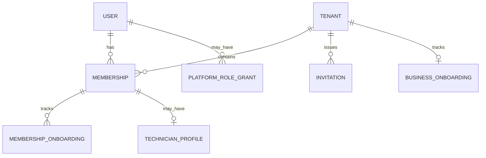
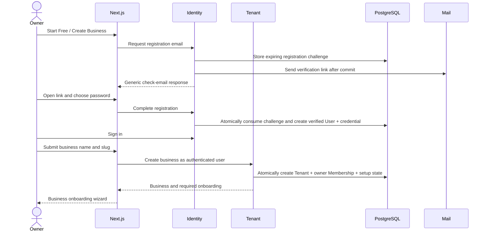
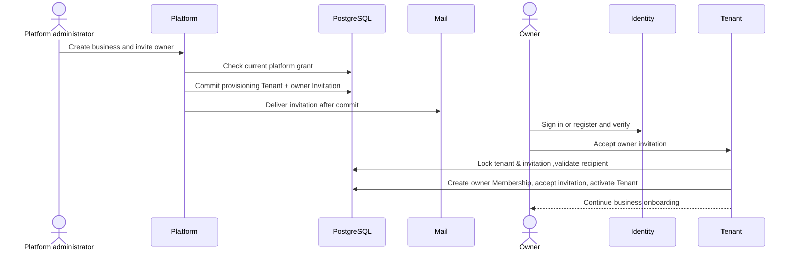
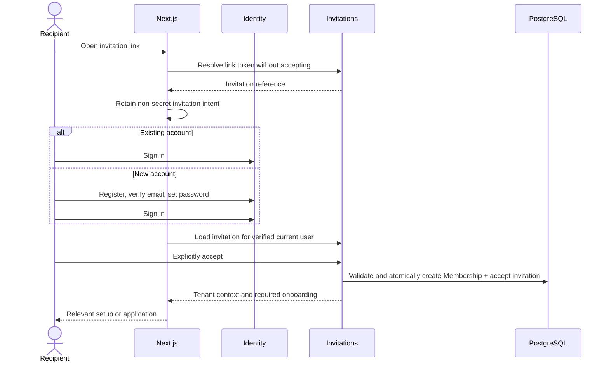
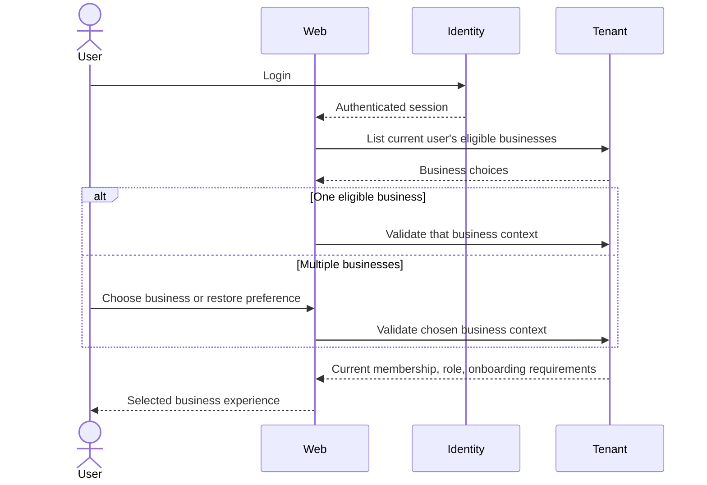

# Login, signup, invitations, tenant selection, and onboarding proposal

Status: **Historical proposal; implementation authorized on 2026-09-27.** The implemented scope and deliberate deferrals are recorded in [ADR 0007](../adr/0007-identity-onboarding.md) and the [implementation contract](identity-onboarding.md). The reviewed baseline below differs from the checkout used for implementation.

Date: 2026-09-27

Reviewed repository baseline: `f566404` (`feat(login) : user login and business onboarding`).

This document preserves the design proposal from the conversation for future review. Recommendations below describe proposed behavior, not capabilities already implemented. Saving this proposal does not change application behavior or supersede existing ADRs.

**Keep the existing global User, tenant Membership, and Spring Security session model. Separate account registration, business creation, invitation acceptance, and onboarding into distinct workflows.**

The review covered the repository instructions, product and architecture documentation, ADRs 0001–0007, and the current identity, tenancy, authentication, authorization, onboarding, and frontend implementation. The repository was clean at `f566404`. No files were modified during the design review itself.

## 1. Current-state assessment

The foundation already supports the central requirement:

| Area | Current behavior | Design implication |
|---|---|---|
| User | Global UUID identity; unique normalized email; no `tenant_id` | Keep |
| Membership | Unique `(tenant_id, user_id)`; one role; independent status | Keep |
| Tenant | Represents one business; stable slug; ACTIVE/SUSPENDED | Keep, extend lifecycle for assisted provisioning |
| Authentication | Spring Security password authentication and server sessions | Keep |
| Authorization | Membership role and tenant/resource checks | Keep |
| Tenant context | Validates `X-Tenant-ID` against current user, membership, and tenant | Keep |
| Signup | Atomically creates a new User, credential, Tenant, and owner Membership | Separate identity registration from business creation |
| Business selection | Lists eligible businesses; always requires selection | Add automatic selection for one business and secure restoration |
| Onboarding | Combined signup form and welcome screen | Add persisted business/membership readiness |
| Invitations, verification, platform administration | Not implemented | Add through separate increments |

The current signup **does not duplicate existing users**: global email uniqueness rejects them. Its limitation is that an existing user cannot use it to create another business or accept an invitation.

The earlier review referred to a business-onboarding ADR 0007 that is absent from this checkout. The current [ADR 0007](../adr/0007-identity-onboarding.md) records the implemented separation of registration and business creation. The earlier identity and tenant-access decisions remain sound.

## 2. Recommended domain model



| Concept | Ownership | Recommendation |
|---|---|---|
| User | Global | Identity, display name, canonical email, account status, verification timestamp |
| PasswordCredential | Global identity | Keep separate from User |
| Tenant | Business | Business identity and operational lifecycle |
| Membership | Tenant relationship | User, tenant, one role, access status |
| Invitation | Tenant | Proposed access awaiting acceptance |
| BusinessOnboarding | Tenant | Completion of required business setup |
| MembershipOnboarding | Membership | Completion of an applicable onboarding flow |
| TechnicianProfile | Tenant business domain | Future skills, availability, employment details |
| PlatformRoleGrant | Platform | Explicit platform authority, independent of memberships |

Keep UUID primary keys, server-managed timestamps, optimistic locking, and restrictive foreign keys.

Keep the existing tenant roles: `BUSINESS_OWNER`, `DISPATCHER`, and `TECHNICIAN`. Reserve `ADMIN` for a milestone that defines its permissions. It should not become an owner-equivalent role merely because it is named administrator. Defer `ACCOUNTANT`.

**Alternative:** tenant-specific Users or a global `User.role`. Both break the existing multi-business identity model. Membership adds joins but accurately represents Bob being a technician in one business and a dispatcher in another.

## 3. Self-service business-owner signup

Separate this into two transactions:

- Establish a verified global account.
- Create a Tenant and its initial owner Membership together.

For new accounts, recommend an **email-first registration**: collect name/email, send a verification link, then let the mailbox holder choose their password and finalize the account. This avoids an attacker pre-registering someone else's address with an attacker-chosen password.

The initial registration attempt is a temporary challenge, not a duplicate User.



Existing verified users skip registration and use **Create another business** while signed in. Business creation obtains the owner ID from authentication, never from an email or request-body user ID.

Initially collect only business name and slug. Company details, timezone, business hours, and team invitations belong in subsequent setup.

**Alternative:** create an unverified User and password immediately. This is workable but requires careful handling of account pre-creation, verification, and recovery. Email-first registration avoids that extra account state while preserving the requested experience.

## 4. Platform-assisted business creation

Add a deliberate tenant lifecycle state: `PROVISIONING`.

A platform administrator creates, in one transaction:

- A `PROVISIONING` Tenant.
- An initial-owner Invitation.
- Business onboarding state.
- An audit event.

A provisioning tenant has no ordinary business access. It is an intentionally incomplete provisioning record, not an ACTIVE tenant accidentally left without an owner.



Platform administrators receive neither the owner's password nor an automatic Membership. They cannot access business records through their platform grant.

Expired or revoked owner invitations leave the tenant in `PROVISIONING`; an authorized platform operator can reissue the invitation. Abandoned provisioning records need an explicit retention policy.

**Alternative:** postpone Tenant creation until acceptance. That avoids ownerless records but needs another entity to hold the proposed business. A restricted provisioning state fits the requested assisted flow more directly.

## 5. Invitation model and existing-user acceptance

Recommended Invitation fields:

| Field | Purpose |
|---|---|
| `id` | UUID identity |
| `tenant_id` | Target business |
| `email` | Canonical intended recipient |
| `role` | Proposed tenant role |
| `purpose` | `TEAM_MEMBER` or `INITIAL_OWNER` |
| `status` | `PENDING`, `ACCEPTED`, `REVOKED`, `EXPIRED` |
| `token_hash` | Digest of a cryptographically random link token |
| `invited_by_user_id` | Authenticated issuer |
| `created_at`, `updated_at`, `expires_at` | Lifecycle timestamps |
| `accepted_at`, `accepted_by_user_id` | Acceptance evidence |
| `revoked_at`, `revoked_by_user_id` | Revocation evidence |
| `version` | Optimistic concurrency |

Invitation creation must not create a User or Membership.

For Bob, who already has an account:

1. An authorized owner invites Bob's normalized email.
2. Bob signs in to his existing account.
3. FieldOps requires verified email matching the invitation.
4. Bob explicitly accepts.
5. One transaction creates the Membership and marks the invitation accepted.

At acceptance, recheck expiry, revocation, tenant state, and the issuer's continuing authority. An owner who lost invitation privileges should not leave outstanding grants that silently remain usable.

Use the existing tenant-row locking convention, with a consistent lock order, to serialize acceptance against relevant membership and invitation changes.

Existing relationship handling:

- **Already active:** do not change its role through an invitation. Return the existing access outcome without duplicating the Membership.
- **Inactive:** do not silently reactivate it. Require the existing authorized reactivation workflow.
- **Already accepted by this user:** return an idempotent outcome; do not create another relationship.
- **Different authenticated email:** reject without changing either account.

**Tradeoff:** these rules make invitations less convenient as a general role-management tool, but prevent old invitations from bypassing deactivation or role changes.

## 6. New-user invitation flow and continuation



Preserve a **non-secret invitation ID and an allowlisted continuation type**, rather than an arbitrary return URL or raw token.

The verified user's pending-invitations API provides recovery if browser state is lost or verification occurs on another device. Login failure currently invalidates the session, so invitation continuation must not depend solely on anonymous-session attributes surviving.

Recommended acceptance authority is: **authenticated verified recipient + live invitation addressed to that recipient**. The email link helps discover the invitation; possession of the link alone never grants membership.

Consequently, verified recipients can also accept from their pending-invitations inbox without retaining the original token.

**Alternative:** require the original bearer token throughout registration and login. That complicates cross-device verification and recovery without adding much protection once mailbox ownership and the exact recipient are verified.

## 7. Login flow

Keep global authentication first. After successful login:

1. Fetch current identity and verification state.
2. Resolve explicit invitation or create-business intent.
3. Determine eligible memberships.
4. Validate the selected business.
5. Determine required onboarding and application destination.

An unverified legacy account may authenticate into a restricted account/verification experience, but cannot accept invitations, create businesses, or enter tenant operations until verified.

Do not equate `ACTIVE` with email verification.

| Situation | Destination |
|---|---|
| Explicit valid invitation intent | Invitation acceptance |
| Explicit create-business intent | Business creation |
| Exactly one eligible business | Automatically validate and select it |
| Multiple eligible businesses | Restore a valid preference or show Choose Business |
| No membership, pending invitations | Invitation inbox/acceptance |
| No membership or invitation | Offer Create a Business |
| Platform-only user | Platform console after checking platform authority |

Without explicit intent, pending invitations should remain visible even when the user already has other memberships.

## 8. Multi-tenant selection and active context

Keep the current `AuthenticatedTenantContext` semantics:

```text
Global authentication: userId

Validated tenant request:
  userId
  tenantId
  membershipId
  current role
```

Prefer tenant identity in frontend application routes, for example `/app/{tenantId}/…`. The client sends that selection through the existing `X-Tenant-ID` header. Spring validates it on every request.

A previous selection may be stored as a **per-tab, user-keyed preference**, never as authority. Restore it only after checking current eligibility. Clear it on logout/account change.



Do **not** add `POST /session/active-tenant` merely to persist a global session selection. That would regress the existing ability for two tabs to work in different businesses.

**Switch Business** keeps authentication, clears tenant-specific client state, cancels outstanding tenant requests, and validates the new selection. Future query-cache keys must include tenant identity. Old responses must not populate the newly selected business.

**Logout** invalidates the session and clears account/tenant client state.

## 9. Role-specific onboarding

Track business setup separately from individual membership setup.

| Scope | Example |
|---|---|
| Global User | Verified email, global name |
| Tenant | Company profile, timezone, business hours |
| Membership | Technician or dispatcher setup for this business |
| TechnicianProfile | Tenant-specific skills, availability, contact details |

Recommend two small progress models:

- `BusinessOnboarding`: one row per tenant, recording the completed setup version and completion timestamp.
- `MembershipOnboarding`: one row per `(membership_id, flow_key)`, recording the completed flow version and completion timestamp.

Example flow keys: `TECHNICIAN_SETUP`, `DISPATCHER_SETUP`, and later `ADMIN_SETUP`.

Derive remaining steps from real domain data plus a code-defined checklist. Persist domain data when each step is saved. Do not make a client-submitted `completed=true` authoritative.

A completion operation validates all currently required steps. Progress records are evidence that a checklist was satisfied, not substitutes for underlying data validation.

Important behavior:

- Owner business configuration is shared by the business; a second owner does not repeat it.
- Inviting teammates is skippable, so a sole proprietor can finish.
- A role change evaluates the newly applicable flow.
- Completion in Tenant A does not complete Tenant B.
- Technician requirements are added when the technician domain exists.
- Do not block users on screens that have not been implemented.

**Alternatives:** one User boolean has the wrong scope; one Membership boolean loses role/version meaning; a configurable workflow engine adds unnecessary complexity. Two scoped progress tables and explicit code keep this understandable.

## 10. Platform Admin flow

Introduce explicit platform grants, separate from Membership:

```text
PlatformRoleGrant
  userId
  role = PLATFORM_ADMIN
  status
  grantedBy
  grantedAt
  revokedAt
```

Platform operations check the current grant independently of tenant authorization.

- No automatic grant for users without memberships.
- No tenant-data bypass.
- No automatic Membership on assisted creation.
- No password creation or impersonation.
- Initial grant uses a controlled operator procedure with auditing.
- A user with both platform and tenant access explicitly chooses the relevant experience.

Require stronger authentication, including MFA, before exposing privileged platform administration publicly. This can justify an OIDC provider later without changing User or Membership ownership.

## 11. Authentication/session strategy

**Retain Spring Security server-side sessions.**

| Option | Benefits | Costs | Recommendation |
|---|---|---|---|
| Existing servlet sessions | Established implementation; immediate logout; browser-friendly | Instance-local; lost on restart | Keep now |
| JWT access/refresh tokens | Useful for independent API consumers | Refresh rotation, revocation, signing-key management, stale claims | No current need |
| External OIDC | Managed MFA, recovery, federation | Provider operations, identity linking, configuration | Reevaluate for actual SSO/MFA requirements |

Keep secure HttpOnly cookies, SameSite policy, CSRF protection, session-ID rotation, and disabled-user checks. Spring already provides the session persistence mechanisms needed here. [Spring Security session documentation](https://docs.spring.io/spring-security/reference/servlet/authentication/session-management.html)

Do not introduce Redis solely for this design. Revisit session storage when multi-instance deployment or restart persistence becomes a requirement.

## 12. Recommended API boundaries

Preserve current names where they work.

| API | Access and purpose |
|---|---|
| `POST /api/v1/auth/signup` | Public, CSRF-protected registration-email request; generic 202 |
| `POST /api/v1/auth/signup/complete` | Token + password; atomically consume challenge and create verified identity |
| `POST /api/v1/auth/email-verification/request` | Restricted authenticated legacy account; rate-limited resend |
| `POST /api/v1/auth/email-verification/confirm` | Matching authenticated identity + token |
| Existing `/auth/login`, `/auth/logout`, `/auth/csrf` | Keep existing protocol |
| `GET /api/v1/auth/me` | Extend with verification state; retain global scope |
| `GET /api/v1/businesses` | Keep current eligible-business discovery |
| `POST /api/v1/businesses` | Verified authenticated user creates Tenant + own owner Membership |
| Existing `GET /api/v1/tenant/context` | Validate selected tenant; do not mutate login session |
| `POST /api/v1/tenant/invitations` | Authorized selected-tenant actor; email and permitted role |
| `GET /api/v1/tenant/invitations` | Authorized, tenant-scoped, paginated invitation administration |
| `POST /api/v1/tenant/invitations/{id}/revoke` | Authorized revocation |
| `POST /api/v1/tenant/invitations/{id}/resend` | Revalidate authority, rate-limit, rotate token |
| `POST /api/v1/invitations/resolve` | Token in body; minimal link resolution; no acceptance |
| `GET /api/v1/auth/me/invitations` | Pending invitations for verified current email |
| `POST /api/v1/invitations/{id}/accept` | Verified recipient; transactional acceptance |
| `GET /api/v1/tenant/onboarding` | Current business and membership requirements |
| `POST /api/v1/tenant/onboarding/business/complete` | Authorized owner; server validates business checklist |
| `POST /api/v1/tenant/onboarding/me/{flow}/complete` | Own applicable membership flow; server validates |
| `POST /api/v1/platform/businesses` | Platform grant; create provisioning tenant and owner invitation |

Actual setup fields should use domain-specific update endpoints as those features arrive. Do not expose a generic arbitrary onboarding-data endpoint.

Every cookie-authenticated mutation retains CSRF protection. Invitation acceptance intentionally does not require prior membership: it uses the separate verified-recipient policy.

## 13. Database/schema changes

Use new Flyway migrations after V5; do not edit released migrations.

| Table/change | Main constraints and indexes |
|---|---|
| `users.email_verified_at` nullable `timestamptz` | Existing users start unverified; no fabricated verification |
| `email_challenges` | UUID PK; purpose; canonical email; optional User FK for existing-account verification; unique token digest; expiry/consumed/revoked timestamps |
| Tenant lifecycle | Add `PROVISIONING` to allowed values; existing statuses unchanged |
| `invitations` | Tenant/actor FKs; canonical email; permitted role/purpose/status checks; unique token digest |
| `business_onboarding` | Tenant PK/FK; nonnegative completed version; completion timestamp; optimistic version |
| `membership_onboarding` | PK `(membership_id, flow_key)`; Membership FK; completion version/timestamp |
| `platform_role_grants` | Unique `(user_id, role)`; explicit lifecycle and actor references |
| Security audit records | Actor, action, outcome, target, optional explicitly scoped tenant, timestamp, correlation ID |

Invitation indexes should support:

- Token lookup: unique `token_hash`.
- Tenant administration: `(tenant_id, created_at, id)`.
- Recipient inbox: `(email, status, expires_at)`.
- At most one pending invitation per `(tenant_id, email)` through a partial unique index.

**Expiry detail:** a PostgreSQL partial index must not depend on a moving `now()` predicate. Before issuing a replacement, explicitly expire an elapsed pending invitation in the transaction. Acceptance always checks `expires_at`, regardless of whether cleanup has updated its status.

Add checks tying acceptance/revocation timestamps and actors to their corresponding states.

TechnicianProfile remains deferred. When introduced, include `tenant_id` and a tenant-consistent Membership reference, enforced with a composite foreign key.

**Migration policy:** retain existing users, credentials, IDs, memberships, and tenants. Mark unknown verification/setup facts as unknown; do not silently declare them verified or complete. Existing users need a clear verification transition and recovery path.

## 14. Security considerations

- **Passwords:** retain the current Spring encoder and explicit BCrypt byte limit initially. Add breached-password screening and recovery before public rollout. Argon2id can be evaluated separately; changing algorithms also affects the current database hash-format constraint.
- **Email:** reuse the exact global normalization policy. Do not strip dots/plus tags, infer aliases, or merge identities.
- **Tokens:** use established cryptographic randomness, such as Java `SecureRandom`, with 256-bit tokens and standard digests. Store token hashes, never raw link tokens. Proposed starting lifetimes: 24 hours for verification and seven days for invitations.
- **Replay:** atomically consume verification challenges; atomically accept invitations with Membership creation. Concurrent submissions must produce one effective grant.
- **Email matching:** require the current verified canonical email. The invitation cannot reset credentials or choose a different recipient during acceptance.
- **Link safety:** prefer an email-link fragment that the browser submits in a POST body, then removes from the address bar. Keep token pages free of third-party assets and use `Referrer-Policy: no-referrer`. GET must never accept an invitation or verify an account automatically.
- **CSRF/session handling:** keep Spring protections and the same-origin proxy. Do not put credentials, sessions, or bearer invitation tokens in local storage.
- **Abuse controls:** apply bounded limits to login, signup, verification, invitation resolution, and email delivery. Combine account-oriented and network-oriented limits; avoid permanent lockouts attackers can weaponize.
- **Enumeration:** return generic signup/login/resend responses and avoid public email-existence APIs. Do not claim that generic wording alone makes response timing indistinguishable.
- **Redirects:** use enumerated continuation intents and validated internal IDs, not arbitrary `returnTo` URLs.
- **Auditing:** record registration, verification, authentication outcomes, invitation lifecycle, membership grants, business creation, and platform actions. Exclude passwords, raw tokens, hashes, and session cookies.
- **Tenant enforcement:** revalidate membership and tenant state on each request. Onboarding completion never grants extra permissions.

Random, expiring, securely stored, single-use tokens follow established recovery-token guidance; applying those properties to invitations is this proposal's design choice. [OWASP token guidance](https://cheatsheetseries.owasp.org/cheatsheets/Forgot_Password_Cheat_Sheet.html) Generic authentication responses and throttling also follow established guidance. [OWASP authentication guidance](https://cheatsheetseries.owasp.org/cheatsheets/Authentication_Cheat_Sheet.html)

Verification and invitations now create a concrete email-delivery requirement. Start with a standard mail integration **after database commit**, explicit delivery failure handling, and rate-limited resend. A failed email must not create access or roll back a committed account inconsistently. If reliable automatic retries are required, add persisted delivery work deliberately; do not introduce Kafka or hold database transactions open during email calls.

## 15. Frontend routing strategy

| Route | Purpose |
|---|---|
| `/` | Landing page with Sign in / Create Business |
| `/signup` | Global account registration |
| `/signup/complete` | Verification and password setup |
| `/verify-email` | Existing-account verification |
| `/login` | Existing global login |
| `/invitations/accept` | Resolve link and continue recipient flow |
| `/invitations` | Verified user's pending invitations |
| `/create-business` | New business for signed-in verified user |
| `/select-business` | Multiple-business selection or empty state |
| `/app/[tenantId]` | Validated tenant entry and destination resolution |
| `/app/[tenantId]/onboarding/business` | Business setup |
| `/app/[tenantId]/onboarding/technician` | Future technician setup |
| `/app/[tenantId]/onboarding/dispatcher` | Applicable dispatcher setup |
| `/platform` | Independently authorized platform console |

Keep `/workspace` temporarily as a compatibility entry into the new destination resolver. Redirect `/onboarding` to the appropriate signup or business-creation step when replacing the old combined form.

Tenant IDs in routes identify a selection; backend validation still determines access. Frontend guards improve navigation but are not authorization.

## 16. Existing code impact

| Classification | Existing area | Proposed impact |
|---|---|---|
| **KEEP** | User/Tenant/Membership identity model | Preserve IDs, normalization, unique constraints, ownership boundaries |
| **KEEP** | Authentication configuration and credential services | Preserve sessions, hashing, CSRF, logout |
| **KEEP** | AuthenticatedTenantContext and scoped repositories | Preserve per-request validation |
| **KEEP** | Owner administration locking and last-owner rule | Reuse conventions for invitation acceptance |
| **KEEP** | BusinessDirectory | Extend summaries only where selection/setup needs it |
| **MODIFY** | User and current-user DTO | Add verified-email state |
| **MODIFY** | BusinessOnboardingService | Create Tenant + Membership for current verified User; stop creating identity here |
| **MODIFY** | Workspace routing | Add intent resolution, automatic selection, restoration, onboarding gates |
| **MODIFY** | Next.js proxy allowlist | Add approved endpoints with unchanged security boundaries |
| **ADD** | Registration challenges and verification | Establish mailbox ownership safely |
| **ADD** | Invitation model/use cases | Support new and existing recipients |
| **ADD** | Scoped onboarding progress | Avoid global completion flags |
| **ADD** | Platform grants/provisioning | Keep platform authority separate |
| **ADD** | Email delivery, abuse controls, audit events | Support the new public flows |
| **REMOVE after transition** | Public combined account-and-business signup endpoint | Otherwise it remains a verification bypass |
| **REMOVE after transition** | Mandatory business selection for exactly one business | Replace with validated automatic selection |

Do not silently change the existing endpoint's request meaning. Move the UI to the new APIs, then explicitly retire the legacy creation endpoint in a coordinated release.

## 17. Recommended implementation order

1. Approve this design and record a superseding ADR.
2. Add email challenges, delivery handling, verification, abuse controls, and identity-event auditing.
3. Add standalone global registration and legacy-user verification.
4. Add authenticated business creation using the existing User.
5. Replace the combined signup UI/API and update destination resolution.
6. Implement owner-issued invitations, recipient continuation, and atomic acceptance.
7. Add tenant-specific and membership-specific onboarding progress.
8. Implement platform grants and restricted assisted provisioning.
9. Add technician/dispatcher domain screens only with those domain milestones.

This order delivers existing-user business creation and invitations without replacing working authentication or prematurely building operational dashboards.

## 18. Required tests

Use PostgreSQL Testcontainers for persistence and HTTP integration tests; no H2.

- One User can own Business A and join Business B without another User row.
- Normalized email remains globally unique under concurrent registration.
- Registration challenges expire, cannot be replayed, and cannot overwrite an existing credential.
- Business creation requires verified authentication and atomically creates the owner Membership.
- Invitation creation creates neither User nor Membership.
- Existing/new recipients can complete their respective flows.
- Wrong-email, expired, revoked, suspended-tenant, and unauthorized invitations fail.
- Concurrent acceptance creates one Membership.
- Acceptance does not reactivate inactive membership or overwrite an existing role.
- Revocation, role changes, and acceptance races preserve the intended access rules.
- Assisted provisioning remains inaccessible until valid owner acceptance.
- Platform grants never imply tenant membership or tenant-data access.
- One/multiple/zero-business login routing and invitation priority behave correctly.
- Two tabs can operate in different tenants; revoked selections fail on later requests.
- Onboarding progress stays isolated by tenant, membership, flow, and version.
- Migration tests preserve all existing identities and relationships.
- Browser tests cover continuation through signup/login, wrong-account handling, switching, logout, refresh, mobile layouts, and expired links.
- Existing authentication, RBAC, isolation, and persistence tests remain regression gates.

### Verification status at the time of the proposal

The earlier implementation passed 87 backend tests. Its final Chrome rerun was blocked by the approval-service usage limit, so that browser verification remained outstanding at the time of this review. The design review did not run or alter it. This is a historical verification note, not a claim that the proposed workflows have been implemented or tested.
