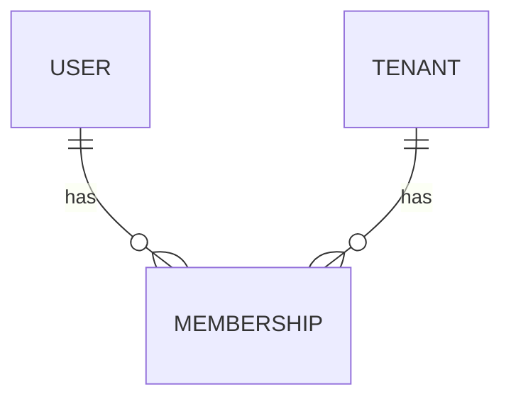

# User and membership domain

Status: implemented for [FIELD-003](https://github.com/TushGH/fieldops/issues/3). FIELD-003 establishes identity records and relationships. FIELD-004 adds [session authentication](authentication.md); authorization remains deferred. See [ADR 0004](../adr/0004-users-and-tenant-memberships.md) for the decision and alternatives.

## Domain boundaries

- **User:** a global FieldOps identity/profile, owned by `identity`. It has no tenant_id. FIELD-004 optionally adds a separate local password credential; a profile alone remains neither a login credential nor a verified identity.
- **Tenant:** one service business and its business-data ownership boundary, owned by `tenant`. The [existing Tenant design](tenant-domain.md) is unchanged.
- **Membership:** the relationship between one user and one tenant, owned by `tenant`. It has its own identity and lifecycle and currently contains no roles or permissions.

A user can have zero, one, or multiple memberships. A tenant can have multiple users, and the same user can participate in several independent businesses without duplicating their profile. A user without memberships has no implied platform role or access. The database also permits tenants without users while onboarding remains undefined.

The alternative of users.tenant_id would simplify queries but require duplicate profiles or identity migration when a person participates in more than one business. A separate Membership costs one table and joins but provides a natural home for tenant-specific lifecycle and future roles. It does not imply franchise support or a tenant-switching UI.

## Schema and fields

V3 creates the following tables in the existing shared PostgreSQL database. V1 and V2 remain unchanged, and Hibernate continues to validate mappings.

| User field | PostgreSQL column/type | Rule |
| --- | --- | --- |
| id | id uuid | UUID v4 primary key; immutable |
| displayName | display_name varchar(200) | Required trimmed nonblank name; control characters rejected; not unique |
| email | email varchar(254) | Required canonical ASCII email; globally unique; immutable in this issue |
| status | status varchar(20) | ACTIVE or DISABLED |
| createdAt | created_at timestamptz | Required immutable creation instant |
| updatedAt | updated_at timestamptz | Required last persisted change instant |
| version | version bigint | Required nonnegative optimistic-lock version, initially zero |

| Membership field | PostgreSQL column/type | Rule |
| --- | --- | --- |
| id | id uuid | UUID v4 primary key; immutable |
| tenantId | tenant_id uuid | Required immutable reference to tenants.id |
| userId | user_id uuid | Required immutable reference to users.id |
| status | status varchar(20) | ACTIVE or INACTIVE |
| createdAt | created_at timestamptz | Required immutable creation instant |
| updatedAt | updated_at timestamptz | Required last persisted change instant |
| version | version bigint | Required nonnegative optimistic-lock version, initially zero |

Membership has a unique constraint on `(tenant_id, user_id)` across all statuses. Both foreign keys use ON DELETE RESTRICT: ordinary deletion must not silently erase relationship records. There is no deletion use case or cascade relationship. Deactivating a membership keeps the pair reserved; reactivate the same record rather than creating another one.

UUID v4 and server-managed timestamps follow the Tenant implementation. Numeric IDs would be more compact but introduce a second identity convention. A composite Membership primary key could avoid a surrogate ID but complicates JPA identity mapping and future audit references. The pair's unique constraint still enforces the actual business invariant.

Nullable Java Long versions identify new assigned-ID entities to Spring Data; Hibernate initializes persisted versions to zero. No client supplies identifiers, audit timestamps, or versions when creating records. Optimistic locking prevents stale profile or membership updates from silently overwriting newer state. These timestamps are not complete actor-based audit history.

## Email policy

Trim Unicode edge whitespace, lowercase with Locale.ROOT, and store one ASCII email per user. The application rejects blanks, whitespace inside addresses, non-ASCII input, and values over 254 characters. Jakarta Bean Validation's Email constraint validates syntax in the user service and before JPA writes. Database checks enforce canonical lowercase ASCII storage and a basic single-at-sign shape; they are not a complete email parser.

The entire address is treated as case-insensitive as an explicit FieldOps product policy. This may exclude providers that distinguish local-part case. Do not strip plus tags or dots, infer provider aliases, or merge users by a supplied address. ASCII-only support excludes internationalized addresses for now; broadening it requires a deliberate normalization and migration policy.

Global uniqueness avoids duplicate identities when joining another tenant. Tenant-scoped uniqueness would instead permit separate profiles for the same person; nonunique emails would require another account-identification policy when authentication arrives. Canonical storage avoids a citext extension or duplicate normalized-email column. Disabled users retain their email reservation.

Email is unverified contact data, not proof of identity. FIELD-004 adds email lookup internally for password login; there is no public email directory, automatic invitation, account linking, email-change operation, or verified flag. Future email changes and external identity linking require ownership verification and authorization design. External authentication identifiers must not replace the stable User UUID.

## Lifecycle and use cases

Users start ACTIVE and support explicit disable(), reactivate(), and rename() domain operations. Memberships start ACTIVE and support deactivate() and reactivate(). Repeating the current status is a no-op. User identity and email, and membership identity and endpoints, have no mutation operations.

Disabling a user does not rewrite memberships. Deactivating one membership does not disable the user or other memberships. Suspending a tenant does not rewrite users. These independent states preserve context and avoid destructive cascades. Future access decisions must evaluate the relevant user, tenant, membership, and permissions together; FIELD-004 enforces global user state for authentication; tenant, membership, and permission enforcement remain deferred.

ACTIVE does not mean authenticated, verified, invited, or authorized. Status enums plus check constraints are sufficient; configurable lookup tables or PostgreSQL enums add no needed flexibility. Invitation/PENDING states, provisioning workflows, and offboarding retention are deferred until their requirements exist.

UserService exposes internal transactional create and read-only findById operations returning immutable UserDetails snapshots. MembershipService exposes internal create and find(tenantId, userId) operations returning MembershipDetails. Foreign keys validate reference existence atomically instead of relying on race-prone existence prechecks. Invalid references or duplicates produce Spring DataIntegrityViolationException with named database constraints; a later API must map those failures safely.

These services deliberately do not implement registration, onboarding, tenant context, user directories, or access control. Membership creation only requires existing rows, not particular parent statuses; it is relationship persistence, not a grant operation. Lifecycle operations are domain methods exercised through JPA tests, not public administrative endpoints.

## Persistence and indexes

Use JPA-mapped domain entities and narrow Spring Data repositories, following FIELD-002. Cross-module references are UUIDs backed by database foreign keys, avoiding bidirectional collections, cascading entity graphs, or repository access across modules.

Only these indexes are created:

- users primary key for identity lookup and referencing foreign keys;
- users unique email index for global canonical uniqueness;
- memberships primary key for persistence and lifecycle updates;
- memberships unique `(tenant_id, user_id)` index for tenant/user lookup and tenant-side reference checks;
- memberships `(user_id)` index for user-side reference checks during deletion, which the tenant-leading index cannot efficiently serve alone.

Do not add name, status, or audit-time indexes before queries need them. Future paginated directories or user-to-tenant listing should receive their own use cases and query-driven indexing.

## Ownership and security boundaries

User is global profile data. A tenant must not eventually be allowed to edit a global identity or see other memberships merely because that user belongs to it. Future tenant-specific display details belong on a tenant-owned profile if required.

Membership lookup includes both tenant and user IDs, but accepting IDs is not authorization. FIELD-003 exposes no HTTP endpoints or authenticated tenant context; FIELD-004 adds global-user authentication endpoints only. Future callers must establish trusted context and fail closed; they must not treat record existence or ACTIVE status as permission.

When a future tenant-owned record needs to reference a tenant member, `(tenant_id, user_id)` can reference the unique Membership pair. A reference to users.id alone proves global existence, not membership in that business. Such a foreign key still does not prove active membership or permission. Add those associations and checks with their actual domain features.

Future business roles belong in tenant scope, not a single User.role field. Platform authority remains separate and must never be inferred from zero memberships or a null tenant. No owner role, last-owner invariant, password/hash, token, session, identity-provider subject, or RBAC tables are added now.

## Verification

JUnit 5 domain tests cover normalization, validation, and lifecycle behavior. PostgreSQL Testcontainers tests cover a V2-to-V3 upgrade preserving existing tenants, independent user persistence, multi-tenant membership, global email and pair uniqueness including concurrent claims, inactive pair reservation, foreign keys, restricted deletion, direct-write constraints, timestamp/version changes, stale-update rejection, and transaction rollback across user/membership creation. Existing tenant and health tests continue to run.
